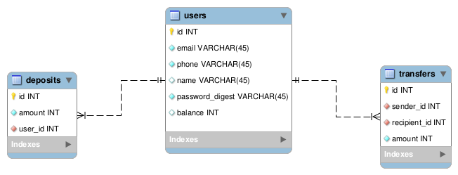

This repo contains code for a demo API developed in rails. The server is deployed on Heroku [here](https://blooming-beyond-39530.herokuapp.com)

The OpenAPI specification *zt-test.yml* is written using [Swagger](https://swagger.io)

> [Postman collection](https://www.getpostman.com/collections/57d19bbfac01ce15f226)

### Tables

*Table designs done in mysql-workbench*

### Stack

- Ruby 2.3.5
- Rails 5
- Postgres 9.5
- Gems
  - [knock](https://github.com/nsarno/knock) for token authentication
  - Bcrypt
